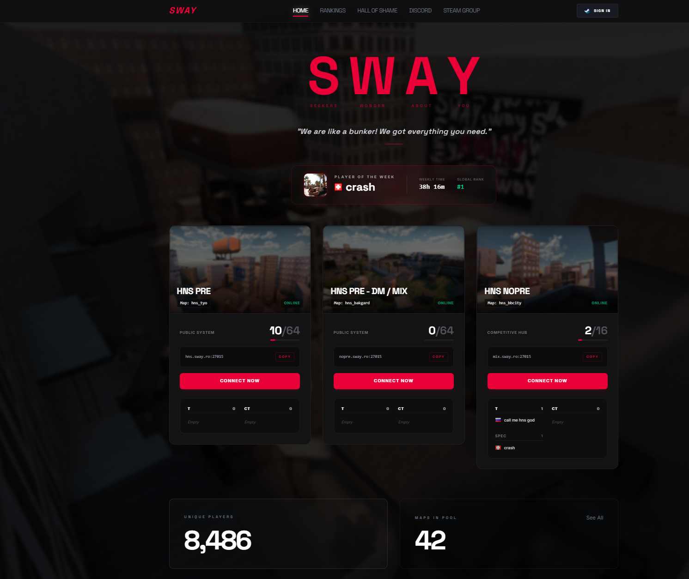
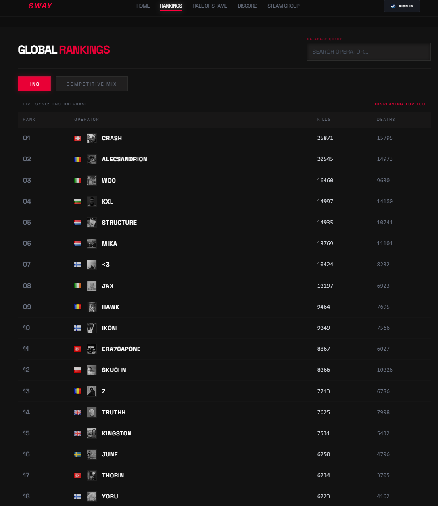
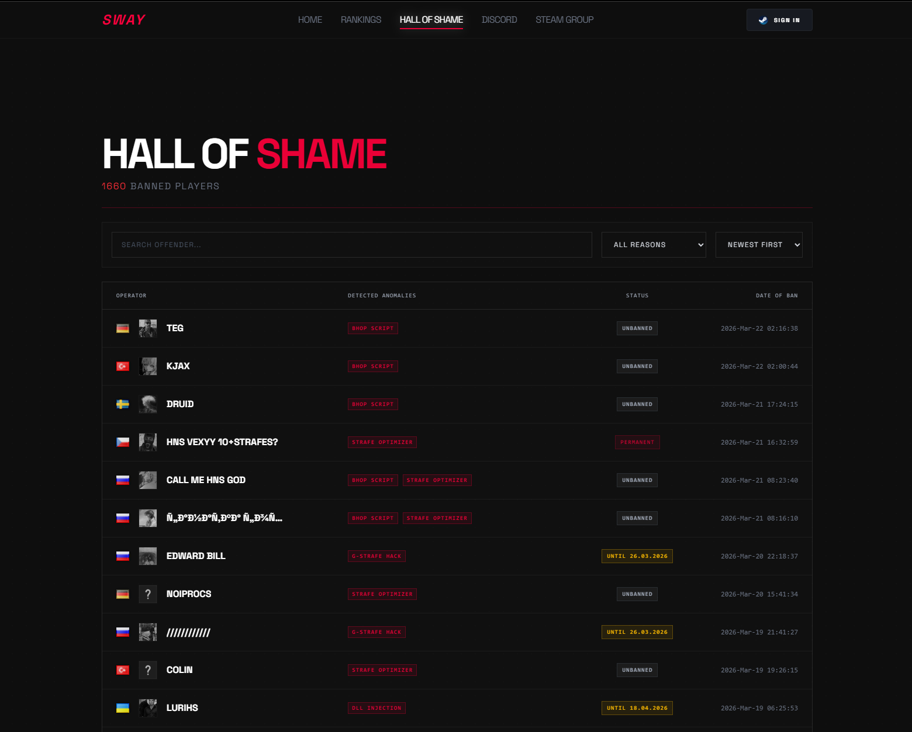
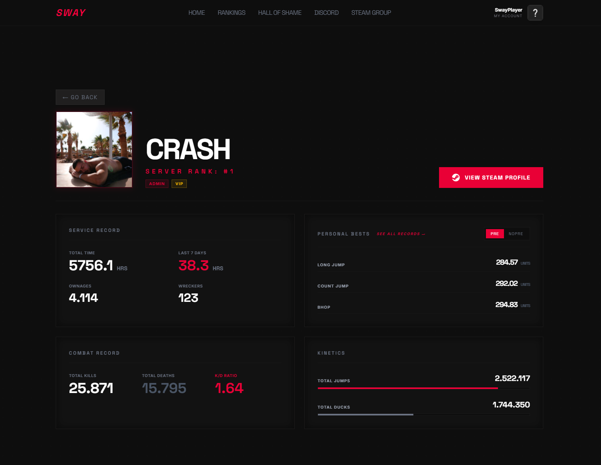

# SWAY - Counter-Strike Server Stats & Anti-Cheat Database

SWAY is a web interface for a Counter-Strike (CS2) server network. It displays real player/server data stored in a MySQL database and provides:

- Server status & connection shortcuts (Home)
- Global operator rankings (Rankings)
- A public "Hall of Shame" for banned/flagged players (Bans)
- Detailed operator profiles with jump/combat stats (Profile)

## Screenshots

### Home


### Rankings


### Bans (Hall of Shame)


### Profile


## Architecture (High Level)

The project is split into:

- `backend/`: Spring Boot REST API (reads/writes from the MySQL database via JPA)
- `frontend/`: React + Vite UI (fetches data from the backend and renders pages)
- `docker-compose.yml` (root): Dockerized MySQL database

### Public API Endpoints

The frontend calls these endpoints:

- `GET /api/players/all`
  - Used by `frontend/src/pages/Leaderboard.jsx`
- `GET /api/servers`
  - Used by `frontend/src/pages/Home.jsx`
- `GET /api/players/{id}`
  - Used by `frontend/src/pages/Profile.jsx`
- `GET /api/cheaters`
  - Used by `frontend/src/pages/Bans.jsx`

All endpoints are served by the backend on port `8080`.

## Database (Real Data via MySQL)

Docker runs MySQL, and the backend reads from the following tables (JPA entities):

- `SWAY_Data`
  - Core player/operator stats (kills, deaths, time, jumps, preferences, etc.)
- `SWAY_JumpStats_Pre`
  - Jump records in PRE mode
- `SWAY_JumpStats_NoPre`
  - Jump records in NOPRE mode
- `SWAY_Cheaters`
  - Banned/flagged players ("Hall of Shame")
- `SWAY_Utilities`
  - Server status snapshots (players, maxplayers, map, factions lists, etc.)

The backend uses:

- `spring.jpa.hibernate.ddl-auto=none`

So the schema is expected to already exist (for example created/filled by your CS2/SWAY data pipeline).

## Running with Docker (MySQL) + Backend + Frontend

### Requirements

- Docker + Docker Compose
- Java 21 (for building/running the backend)
- Node.js 18+ (for the frontend)

### 1. Start MySQL (Docker)

From the repo root:

```bash
docker-compose up -d
```

This starts:

- Service: `db`
- Container name: `cs2_mysql_db`
- Port mapping: `3306:3306`
- Database: `sway_db`
- Credentials (as configured in `docker-compose.yml`):
  - `MYSQL_ROOT_PASSWORD: vic`
  - Backend-side username is `root`

### 2. Start the backend (Spring Boot)

From `backend/`:

```bash
mvn spring-boot:run
```

The backend listens on:

- `http://localhost:8080`

Backend DB config is in:

- `backend/src/main/resources/application.properties`

Current config:

- `jdbc:mysql://localhost:3306/sway_db`
- username: `root`
- password: `vic`

### 3. Start the frontend (React/Vite)

From `frontend/`:

```bash
npm install
npm run dev
```

The frontend runs on:

- `http://localhost:5173`

## Notes / Configuration To Consider Before Launch

1. **Backend URL is hardcoded in the frontend**  
   The React pages currently call `http://localhost:8080/api/...` directly. For production, move this into environment variables (e.g. `VITE_API_URL`) or use a reverse proxy.

2. **Authentication is currently simulated**  
   In `frontend/src/App.jsx` the Steam login is stubbed for UI testing (the real backend auth call is commented out).

3. **CORS settings**  
   Backend CORS allows `http://localhost:5173` (and `cheaters` uses `origins="*"`). For production, lock this down.

## Project Structure

- `frontend/`: React UI
- `backend/`: Spring Boot REST API + JPA entities/repositories
- `docker-compose.yml`: MySQL container

